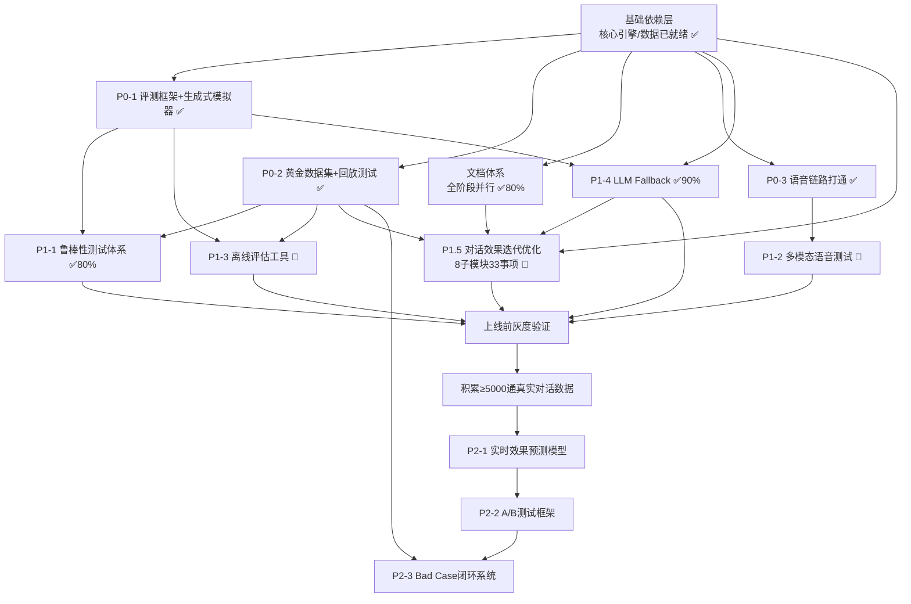

# 🚀 项目路线规划与TODO总览
> 本文档记录项目整体发展路线、详细任务拆解、依赖关系，持续更新。

---

## 🎯 项目核心目标
面向印尼信贷市场的全流程智能语音催收系统，覆盖宽限期提醒（H2/H1）到实质性逾期催收（S0）全催收阶段，用AI替代80%以上人工重复性工作，在保证回款率不低于人工80%的前提下，降低60%人力成本，实现催收流程标准化、数字化、智能化。

---

## 📊 整体发展阶段
| 阶段 | 状态 | 核心目标 |
|------|------|----------|
| **MVP验证** | ✅ 已完成 | 核心对话引擎、语音能力打通，基础场景成功率85%+ |
| **能力增强** | ✅ 已完成 | 评估体系、语音链路、客户语音模拟器、Web Demo全部就绪 |
| **生产落地** | ⏳ 进行中 | P1 任务 60% 完成，CI/CD 已就绪，待接入 SIP 线路灰度上线 |
| **迭代优化** | ⏳ 长期 | 数据驱动闭环迭代，效果持续提升 |

---

## 📊 进度快照（2026-05-09 更新）

| 维度 | 完成度 | 关键数据 |
|------|--------|----------|
| P0 紧急任务 | **100%** (18/18) | 评测框架、黄金数据集、语音链路全通 |
| P1 高优任务 | **71%** (17/24) | LLM Fallback ✅、鲁棒性 ✅、离线评估 0%、多模态语音 0% |
| P1.5 效果优化 | **24%** (8/34) | P15-G03 校准模型 ✅、P15-G04 模拟器升级 ✅、P15-A02 沉默破解 ✅、P15-H01 LLM话术生成 ✅、P15-G01 校准基线 ✅、P15-A01 异议反驳链 ✅、P15-G02 分阶段×分客群调研 ✅、P15-B06 全维度数据梳理 ✅、26 项待启动 |
| 文档完善 | **90%** (14/18 已完成) | LLM策略路由 ✅、第一性原理+Gold推演 ✅ |
| P2 长期任务 | **0%** | 依赖真实生产数据积累 |

### 关键资产盘点
| 资产 | 规模 |
|------|------|
| 标注数据 | 1130 条对话 + 77 通真实录音转写 |
| 黄金测试集 | 2,210 条标准化案例（覆盖全场景） |
| 鲁棒性用例 | 120 条（5 大高风险类别） |
| 真实通话音频 | 1,459 通已下载，ASR 转写 2,288 条（含带 repay_type 标签） |
| 意图分类体系 | 19 类，ML 准确率 77.33% |
| 测试套件 | 15+ 测试文件，21 个语音模式测试 |
| CI/CD | GitHub Actions 全流程（检查→测试→构建→部署） |
| **LLM 生成话术库** | **980 条（49 类别 × 20 变体，deepseek-v4-pro）** |

### 数据管道运行记录（2026-05-08）
| 阶段 | 输入 | 产出 | 成功率 |
|------|------|------|--------|
| 音频下载 | 1,459 条 URL | 1,459 个 mp3 | 100% |
| ASR 转写 | 1,459 个音频 | 2,288 条转写（含历史） | 96.4% (82 空转录) |
| 标注入库 | 2,288 条转写 | 2,210 条黄金案例 | 96.6% (82 无法标注) |

### 意图分布分析（2026-05-09）
| 意图 | 数量 | 占比 | 问题 |
|------|------|------|------|
| unknown | 1,666 | **44.8%** | regex 自动标注漏掉大量异议意图 |
| confirm_identity | 779 | 20.9% | |
| greeting | 353 | 9.5% | |
| agree_to_pay | 344 | 9.2% | |
| no_money | 4 | 0.1% | **严重低报** — 真实通话中远高于此 |
| dont_know | 1 | 0.03% | **严重低报** |
| threaten | 1 | 0.03% | **严重低报** |

> 结论：现有 regex 自动标注器对异议类意图几乎完全失明。P15-C01 将用 LLM 精标注从 unknown 池中挖掘真实意图，作为 ML 分类器训练数据。

### P15-G02 分阶段×分客群策略调研（2026-05-09）

**数据源**: XLSX 原始标注集 (1,130条) × gold_dataset (806条可链接) × fetched_leads_deduped.csv (1,459条)

**`new_flag` 定义修正**:
| new_flag | 含义 | CSV占比 |
|----------|------|---------|
| 0 | 新客（首贷） | 52.9% |
| 1 | 新转老（首次续贷） | 15.1% |
| 2 | 老客（多次复贷） | 31.9% |

**`chat_group` = 真实催收阶段** (CSV 中 proper parsing 后仅 4 个值: H2/H1/S0/空):
| 阶段 | CSV数量 | 占比 |
|------|---------|------|
| H2 | 799 | 54.8% |
| S0 | 410 | 28.1% |
| H1 | 247 | 16.9% |

> ⚠️ gold_dataset 的 `basic_info.collection_stage` 全部为 H2（标注默认值），真实阶段需从 XLSX/CSV 的 `chat_group` 字段获取。

**核心透视表: new_flag × stage × 实际还款** (CSV 1,459条):

| 客群 | 阶段 | 数量 | repay | extend | 有效还款率 |
|------|------|------|-------|--------|-----------|
| 0 新客 | H1 | 149 | 32.9% | 9.4% | **42.3%** |
| 0 新客 | H2 | 389 | 41.1% | 15.4% | **56.6%** |
| 0 新客 | S0 | 234 | 19.2% | 9.0% | **28.2%** |
| 1 新转老 | H1 | 29 | 51.7% | 13.8% | **65.5%** |
| 1 新转老 | H2 | 140 | 65.7% | 21.4% | **87.1%** |
| 1 新转老 | S0 | 51 | 19.6% | 15.7% | **35.3%** |
| 2 老客 | H1 | 69 | 52.2% | 13.0% | **65.2%** |
| 2 老客 | H2 | 270 | 58.9% | 20.0% | **78.9%** |
| 2 老客 | S0 | 125 | 15.2% | 16.8% | **32.0%** |

**806条 gold 匹配案例分析 (对话行为量化)**:

| 客群 | 阶段 | cases | call_result成功 | 有效还款 | 平均轮次 | 配合信号 | unknown意图 |
|------|------|-------|-----------------|----------|---------|---------|------------|
| 0 新客 | H1 | 78 | 48.7% | 41.0% | 11.7 | 2.2 | 3.1 |
| 0 新客 | H2 | 211 | 31.8% | 53.6% | 10.5 | 2.2 | 2.7 |
| 0 新客 | S0 | 119 | 24.4% | 30.3% | **8.2** | **1.1** | 2.6 |
| 1 新转老 | H2 | 65 | 47.7% | 78.5% | 10.9 | 2.5 | 2.5 |
| 1 新转老 | S0 | 43 | 23.3% | 39.5% | **8.7** | **1.1** | 2.9 |
| 2 老客 | H2 | 177 | 42.4% | **90.4%** | 11.5 | 2.4 | 3.1 |
| 2 老客 | S0 | 58 | 24.1% | 53.4% | **8.2** | **1.5** | 2.2 |

**五个量化验证结论**:

1. **S0 是通杀短板** ✅: 所有客群在 S0 有效还款率均垫底 (28-53%)，配合信号 1.1-1.5 远低于 H1/H2 的 2.2-2.7，对话轮次 8.2-8.7 显著短于 H1/H2 (10.5+)。bot 在 S0 过早放弃。
2. **老客 H2 几乎不需要催** ✅: 90.4% 有效还款率，call_result 仅有 42.4% 成功（大量客户未被标记成功但也还款了）。策略应是**轻推+信息确认**，避免施压导致反感。
3. **新客全阶段还款率低于老客 15-25pp** ✅: 同 H2 阶段，新客 56.6% vs 老客 78.9%，差 22pp。新客需要**教育型**开场（解释合同、告知后果），而非直接施压。
4. **新客 S0 是最高风险组合** ✅: 有效还款率仅 28.2%，配合信号 1.1。首贷就进 S0 是坏信号，需**紧急干预**：身份核实+降低门槛(部分还款/展期优先)+后果预警。
5. **call_result 与实际还款存在系统性偏差** ✅: 老客 H2 标记成功 42.4% 但实际还款 90.4% — 大量客户口头不承诺但行动上还款。校准基线 (P15-G01) 在此得到验证。

**策略分化方向 (有量化支撑)**:

| 客群×阶段 | 核心策略 | 量化依据 | 对应任务 |
|-----------|----------|----------|----------|
| 新客 H1/H2 | 教育引导型：解释合同义务、建立还款习惯、降低认知门槛 | 新客配合信号(2.2)＜老客(2.4-2.7)，还款率低15-25pp | P15-B01 |
| 新客 S0 | 紧急干预型：身份核实优先+展期/部分还款优先+后果预警 | 有效还款仅28.2%，配合信号最低(1.1)，轮次最短(8.2) | P15-B01 |
| 新转老 H2 | 维护型：轻推+时机确认+支付方式引导 | 有效还款87.1%，最佳客群 | P15-B01 |
| 老客 H2 | 极轻型：信息同步+时间锚定即可 | 有效还款90.4%，施压会起反效果 | P15-B01 |
| 老客 S0 | 强硬型：后果强调+截止时间+升级预警 | 有效还款53.4%高于新客S0(28.2%)但仍有46%不还，老客知规则需施压 | P15-B01 |

### P15-G01 校准基线关键发现
| 指标 | 值 | 说明 |
|------|------|------|
| 人工精准率 | 50.8% | 坐席标注成功的案例中，真正还款的比例 |
| 假阳性率 (FPR) | 35.3% | 口头承诺但未履约（虚假承诺率） |
| S0阶段精准率 | 30.8% | 实质性逾期阶段承诺可信度极低 |
| DPD≤0 精准率 | 71.7% | 宽限期内承诺可信度较高 |
| DPD 1-7 精准率 | 27.7% | 逾期1-7天后承诺可信度骤降 |

---

## 📋 详细任务拆解与依赖关系
### 基础依赖层（✅ 已就绪，所有任务的根依赖）
> 所有后续任务均基于以下已完成资产构建，无前置依赖：
> - 核心12状态对话引擎、LLM Fallback混合架构（四级降级链）
> - TTS(三引擎)/VAD/ASR/智能打断全链路能力
> - FastAPI服务框架、SQLite+SQLAlchemy持久化
> - 1130条标注对话数据、77条转写真实对话、681条黄金测试集
> - 历史催收业务标签库

---

### 🔹 P0 紧急任务（1-2周，当前开发测试刚需，可并行执行）
| 子模块 | 事项ID | 具体内容 | 前置依赖 | 状态 |
|--------|--------|----------|----------|------|
| **评测框架重构** | P01-01 | 拆解旧`core/evaluation.py`硬编码逻辑，抽离通用可插拔评测接口 | 基础依赖层就绪 | ✅ 已完成 |
| | P01-02 | 从真实对话提取用户行为特征：分阶段回复模式、抗拒策略、印尼口语特征 | 基础依赖层就绪 | ✅ 已完成 |
| | P01-03 | 实现数据驱动生成式客户模拟器，支持用户类型、抗拒等级、场景参数调节 | P01-02完成 | ✅ 已完成 |
| | P01-04 | 定义多维度评估指标体系：效率类、体验类、合规类共12个核心指标 | P01-01完成 | ✅ 已完成 |
| | P01-05 | 将生成式客户模拟器适配到新的通用评测接口 | P01-01、P01-03完成 | ✅ 已完成 |
| | P01-06 | 升级`tests/run_small_scale_test.py`，支持多维度下钻统计，自动生成结构化评测报告 | P01-04、P01-05完成 | ✅ 已完成 |
| | P01-07 | 兼容性验证：原有规则化测试用例可无修改正常运行 | P01-06完成 | ✅ 已完成 |
| **真实对话回放测试** | P02-01 | 标注77条已转写真实对话，补充催收阶段、最终结果、关键节点标记 | 基础依赖层就绪 | ✅ 已完成 |
| | P02-02 | 标准化681条黄金测试数据集，覆盖全场景（超越200条目标），标注催收阶段/场景类型/最终结果 | P02-01完成 | ✅ 已完成 |
| | P02-03 | 实现对话回放引擎：按顺序输入真实用户回复，驱动机器人执行完整对话流程 | 基础依赖层就绪 | ✅ 已完成 |
| | P02-04 | 实现结果对比逻辑：自动对比机器人最终结果、关键节点应对是否符合标注预期 | P02-02、P02-03完成 | ✅ 已完成 |
| | P02-05 | 实现回归测试脚本：支持批量运行所有黄金用例，自动输出失败案例报告 | P02-04完成 | ✅ 已完成 |
| | P02-06 | 集成到CI/CD流程：代码提交自动触发回放回归测试，含代码检查→单元测试→核心测试→Docker构建→部署全流程 | P02-05完成 | ✅ 已完成 |
| **语音链路打通** | P03-01 | 安装TTS/ASR依赖：edge-tts、faster-whisper、sounddevice | 基础依赖层就绪 | ✅ 已完成 |
| | P03-02 | 新建`src/core/voice/asr.py`：封装Faster-Whisper实时识别，支持印尼语，流式识别 | P03-01完成 | ✅ 已完成 |
| | P03-03 | 新建`src/core/voice/audio_io.py`：麦克风录音+扬声器播放，与VAD联动 | P03-01完成 | ✅ 已完成 |
| | P03-04 | 新建`src/core/voice/conversation.py`：串联麦克风→VAD→ASR→纠错→Chatbot→TTS→扬声器全链路 | P03-02、P03-03完成 | ✅ 已完成 |
| | P03-05 | 语音模式接入Demo：start_demo.py增加语音模式入口 | P03-04完成 | ✅ 已完成 |
| **语音仿真测试** | P03-06 | 新建`src/core/voice/customer_simulator.py`：客户语音模拟器，TTS(女声)合成印尼语客户语音 → VAD → ASR → Chatbot → 端到端闭环 | P03-05完成 | ✅ 已完成 |
| | P03-07 | 新建`src/experiments/voice_simulate_demo.py`：CLI语音仿真Demo，支持多种客户画像/抗拒等级，自动生成评估报告 | P03-06完成 | ✅ 已完成 |
| **语音Web Demo** | P03-08 | Web Demo增加语音模式：手动模式Agent TTS播报 + 自动SSE流式语音仿真，前端音频顺序播放 | P03-07完成 | ✅ 已完成 |

---

### 🔹 P1 高优任务（3-4周，上线前必须完成，依赖P0全量完成）
| 子模块 | 事项ID | 具体内容 | 前置依赖 | 状态 |
|--------|--------|----------|----------|------|
| **鲁棒性测试体系** | P11-01 | 梳理高风险场景分类：恶意对抗类、极端抗拒类、逻辑陷阱类、异常输入类 | P0全量完成 | ✅ 已完成 |
| | P11-02 | 编写120条鲁棒性测试用例，覆盖5大高风险场景类别，标注预期处理结果 | P11-01完成 | ✅ 已完成 |
| | P11-03 | 实现自动化测试执行引擎：`robustness_test.py`，批量运行所有测试用例，记录执行过程和结果 | P01-07、P11-02完成 | ✅ 已完成 |
| | P11-04 | 构建合规检查规则库：`compliance_checker.py`，敏感词、违规话术、禁止表述检测规则 | P11-03完成 | ✅ 已完成 |
| | P11-05 | 实现鲁棒性测试报告生成：根因分类 + 合规聚合 + 自动改进建议 + 历史趋势追踪 | P11-04完成 | ✅ 已完成 |
| **多模态语音仿真测试** | P12-01 | 梳理印尼常见口音、背景噪音场景分类（马路/市场/家庭/多人说话等） | ASR功能接入完成 | 📝 待开始 |
| | P12-02 | 构建语音测试数据集：收集不同口音、不同噪音场景下的真实用户语音样本 | P12-01完成 | 📝 待开始 |
| | P12-03 | 实现语音模拟层：支持加载语音样本、模拟不同语速/音量/噪音叠加效果 | P12-02完成 | 📝 待开始 |
| | P12-04 | 打通全链路测试流程：语音输入→ASR识别→对话引擎处理→TTS合成输出→全流程记录 | P12-03、ASR集成完成 | 📝 待开始 |
| | P12-05 | 实现语音链路指标统计逻辑：ASR识别准确率、端到端响应延迟、打断时机准确率、TTS可懂度检测 | P12-04完成 | 📝 待开始 |
| | P12-06 | 实现批量语音测试工具，自动生成语音链路质量报告 | P12-05完成 | 📝 待开始 |
| **离线合成对照评估** | P13-01 | 梳理历史人工催收特征库：逾期阶段、欠款金额、用户画像、历史还款记录等20+维特征 | P0全量完成、历史业务数据就绪 | 📝 待开始 |
| | P13-02 | 实现倾向性得分匹配（PSM）算法：将机器人测试用户与历史人工催收用户做1:1特征精确匹配 | P13-01完成 | 📝 待开始 |
| | P13-03 | 实现效果对比逻辑：对比匹配组的回款率差异，计算95%置信区间 | P13-02完成 | 📝 待开始 |
| | P13-04 | 实现离线评估报告生成：输出机器人相对人工的效果提升率、分群体效果差异 | P13-03完成 | 📝 待开始 |
| | P13-05 | 准确性验证：用已知效果的历史对话验证评估结果与真实效果相关性≥85% | P13-04完成 | 📝 待开始 |
| **LLM Fallback 真实接入** | P14-01 | 评估选型：对比 OpenAI / Claude / 本地模型（Ollama/Llama）的印尼语能力、延迟、成本 | P0全量完成 | ✅ 已完成 |
| | P14-02 | 定义触发策略：5种触发器（连续unknown、不相关回复、复杂抗拒、沉默、低置信度） | P14-01完成 | ✅ 已完成 |
| | P14-03 | 实现上下文组装器：`llm_provider.py`，对话历史摘要 + 用户画像 + 当前催收阶段 → LLM prompt 模板 | P14-02完成 | ✅ 已完成 |
| | P14-04 | 实现 LLM Interface：`llm_provider.py`，支持 OpenAI 兼容 API + Anthropic Messages API，httpx 异步调用 | P14-03完成 | ✅ 已完成 |
| | P14-05 | 构建安全围栏：`compliance_checker.py` post_filter()，LLM 输出合规校验（敏感词过滤、话术规范检查） | P14-04完成 | ✅ 已完成 |
| | P14-06 | 实现降级策略：四级降级链（规则引擎 → LLM → ML分类器 → 默认话术 + 转人工标记） | P14-04完成 | ✅ 已完成 |
| | P14-07 | 端到端集成测试：`chatbot.py` ChatState.LLM_FALLBACK 状态，全链路验证 | P14-05、P14-06完成 | ✅ 已完成 |
| | P14-08 | 效果评估：10 个边界场景 × 2 方案对比（成功率/合规率/延迟/轮次），生成结构化报告 | P14-07完成 | ✅ 已完成 |

---

### 🔹 P1.25 语音管线时延优化（上线前必须完成，依赖语音链路打通）

> 当前双工管线端到端时延 5-15s，其中 ASR 环节占 3-13s。根因：增长窗口 ASR 与完整 ASR 共用 `ThreadPoolExecutor(max_workers=2)`，多个增长窗口任务 + temperature 重试占用全部槽位，最终需要的完整 ASR 排队等待。v0.2.0 已通过 `mark_final()` 立即返回来缓解管线阻塞，但 executor 资源竞争问题未根本解决。

| 子模块 | 事项ID | 具体内容 | 前置依赖 | 状态 |
|--------|--------|----------|----------|------|
| **ASR 资源隔离** | P16-01 | 增长窗口 ASR 使用独立 `ThreadPoolExecutor(max_workers=1)`，完整 ASR 独占另一个 executor，避免资源竞争 | 语音链路打通 | ✅ 已完成 |
| | P16-02 | 增长窗口 ASR 轻量化：`beam_size=1`、关闭 temperature fallback，只做快速扫描（精度不重要，用于部分结果展示） | P16-01 完成 | 📝 待开始 |
| **噪声早停** | P16-03 | temperature 重试早停：`avg_logprob < -1.0` 时大概率是噪声帧，提前中止 temperature 回退循环，避免浪费计算 | 语音链路打通 | 📝 待开始 |
| **executor 扩容** | P16-04 | 评估将 ASR executor `max_workers` 从 2 提升到 3-4，测量时延改善与 CPU/内存代价 | P16-01 完成 | 📝 待开始 |
| **管线时延基准** | P16-05 | 建立时延基准测试：4 种典型语音长度（0.5s/1s/2s/5s），测量各环节分解时延，自动化回归 | P16-01~P16-04 完成 | 📝 待开始 |

---

### 🔹 P1.5 对话效果迭代优化（短周期，无需生产数据，目标成功率 70% → 85%+）

> 基于现有资产（1130条标注数据、681条黄金测试集、119条鲁棒性用例），通过话术/策略/记忆等多维改进提升核心指标。每个方向可独立推进，互不阻塞。

#### 子模块 A：话术与反驳链增强

| 事项ID | 具体内容 | 前置依赖 | 优先级 |
|--------|----------|----------|--------|
| P15-A01 | **多轮异议反驳链**：每个常见借口（没钱/没时间/不认可金额）设计 2-3 步递进反驳话术，替代当前单轮回应→unknown循环 | 基础依赖层就绪 | ✅ 已完成 |
| P15-A02 | **沉默破解热身话术**：对 silent 用户，开场用是非问答替代开放问题（"您收到我们的短信提醒了吗？"），降低回应门槛 | 沉默处理已完成 | ✅ 已完成 |
| P15-A03 | **时间二选一锚定**：push 阶段改写为选择题（"下午3点还是5点方便？"），替代开放式追问，心理学锚定效应提升承诺率 | 基础依赖层就绪 | P1 |
| P15-A04 | **峰终定律优化**：每通电话最后两轮确保正向收尾，即使催收失败也留下清晰后续步骤，提升用户对下次接触的接受度 | 基础依赖层就绪 | P1 |
| P15-A05 | **话术长度自适应**：开场白 ≤ 25 词，push 阶段 ≤ 18 词，close 阶段 ≤ 15 词。统计各阶段用户掉话率与话术长度的关系 | 基础依赖层就绪 | P2 |

#### 子模块 B：用户画像驱动策略

| 事项ID | 具体内容 | 前置依赖 | 优先级 |
|--------|----------|----------|--------|
| P15-G02 | **分阶段×分客群策略调研**：交叉分析 CSV `chat_group`(H1/H2/S0) × `new_flag`(新客/新转老/老客) × `repay_type`(还款结果)，量化验证 9 个客群×阶段组合的行为差异，输出策略分化方向 | P15-G01 完成 | ✅ 已完成 |
| P15-B01 | **分阶段×分客群差异化策略**：根据 `new_flag`(新客0/新转老1/老客2) + `chat_group`(H1/H2/S0) 实现 9 种组合的差异化参数 (approach/tone/push_intensity/extension_priority/max_turns)，替换当前一视同仁策略 | P15-G02 完成 | P0 |
| P15-B06 | **全维度数据梳理与策略映射**：梳理 CSV 39 个字段的业务含义（基于 SQL 溯源），量化各维度对还款结果的预测力，输出"维度→策略参数"映射表，作为 B01-B05 的数据基础 | P15-G02 完成 | P0 |

**CSV 39 字段全维度梳理 (P15-B06 调研结果)**：

SQL 溯源自 10+ 张 ClickHouse 表 JOIN，chat_group 源自 group_id 映射 (92→H2, 93→H1, 94→S0)，repay_type 定义为通话后 12h 内还款申请成功记录。

**▸ 高预测力维度 (直接入策略)**：

| 维度 | 字段 | 分布 | 有效还款率 | 策略含义 |
|------|------|------|-----------|----------|
| **DPD 逾期天数** | `dpd` | ≤0: 781条 / 1-7: 123条 / >7: 555条 | **97.1% / 35.8% / 0.7%** | DPD≤0 几乎必还无需催；DPD 1-7 是催收发挥空间；DPD>7 基本催不回 |
| **历史还清率** | `paidoff_loan_cnt/ total_loan_cnt` | 好(>70%): 518条 / 中(30-70%): 450条 / 差(<30%): 491条 | **87.5% / 63.6% / 13.6%** | 历史行为强预测未来：好客户轻推，差客户需强硬策略 |
| **收入/借款比** | `monthly_income/ approved_amount` | >3x(宽裕): 1369条 / 1-3x(刚好): 71条 / <1x(无法覆盖): 19条 | 54.1% / **83.1%** / 36.8% | 刚好覆盖者还款最积极（有压力+有能力）；宽裕者不急 |
| **call_time 时段** | `call_time` | 待分析 | 待分析 | 通话时段影响接通率和配合意愿 |

**▸ 中等预测力维度 (辅助策略)**：

| 维度 | 字段 | 关键发现 |
|------|------|----------|
| 产品 | `product_name` (UangNow/PinjamPro/DuitFast) | PinjamPro 68.8% > DuitFast 57.4% > UangNow 53.2%，差15pp |
| 婚姻状态 | `marital_status` | 离异 65.0% > 未婚 56.1% > 丧偶 55.7% > 已婚 54.7% |
| 借款次数 | `current_loan_seq` (1-60) | 越多次借款越有经验，策略复杂度不同 |
| 坐席组 | `seats_name` (CTM-xxx, 27个组) | 不同组的客户地域分布不同，间接反映地域差异 |

**▸ 低预测力维度 (可忽略或仅微调)**：

| 维度 | 原因 |
|------|------|
| 性别 (`gender`) | 男 54.8% vs 女 56.1%，几乎无差 |
| `reloan_flag` | 全为 0，完全无信息量 |
| `collection_status` | 仅 2/3 两个值，区分度低 |
| 地址 (`home_address`/`company_location`) | 太细粒度，无法直接用于策略 |

**▸ 关键数据质量发现**：

- **DPD 与 new_flag 存在相关性**：新客(0) DPD ≤ 0 占 38%，老客(2) DPD ≤ 0 仅 8% — 老客逾期更深
- **历史还清率与 new_flag 强相关**：new_flag=2(老客) 中 "好" 占 72%，new_flag=0(新客) 中仅 18%
- **DPD>7 的 555 条中 99.3% 为空还款**：这些通话发生在严重逾期阶段，催收基本无效，应标记为 "不可催收"
- **repay_type 定义限制**：仅追踪通话后 12h 内还款，超过 12h 的还款被标为空 — 存在时间窗口截断偏差

> 结论：策略参数应由 4 个一级维度 (chat_group + new_flag + dpd + 历史还清率) 交叉定义核心骨架，3 个二级维度 (收入比 + 产品 + 婚姻状态) 做微调。9 个客群组合 × 3 个 DPD 档位 = 27 种策略模板。
| P15-B02 | **承诺违约升级链**：读取 `promise_repay_date` + 历史联系记录，曾承诺未兑现→自动升级追问语气和策略 | 跨会话记忆（P15-D01） | P0 |
| P15-B03 | **收入适配策略**：根据 `monthly_income / approved_amount` 比值切换施压强度（直接施压/方案引导/减负同理） | 基础依赖层就绪 | P1 |
| P15-B04 | **紧急联系人施压**：H1/H2 阶段≥2次联系失败后，逐个联系已授权紧急联系人，不透露债务细节仅请求转达回电 | 数据字段扩展 | P1 |
| P15-B05 | **人口/职业适配**：年龄组（青年/中年/年长）、婚姻子女状态、职业类型差异化语气和还款时间建议 | 基础依赖层就绪 | P2 |

#### 子模块 C：意图识别与NLU增强

| 事项ID | 具体内容 | 前置依赖 | 优先级 |
|--------|----------|----------|--------|
| P15-C01 | **意图分类器数据飞轮**：用 LLM 精标注 200-500 条真实转写（从 1,666 条 unknown 中挖掘异议意图），标注结果训练 ML 分类器，目标准确率 77%→85%+ | LLM Fallback 已完成 | ⏳ 进行中 |
| P15-C02 | **ASR领域词汇注入**：将印尼金融催收领域高频词（产品名、还款术语、印尼金钱俚语）注入 Whisper 词表，降低关键信息误识别率 | ASR 链路已完成 | P1 |
| P15-C03 | **还款困难度自评**：在 ASK_TIME 状态前插入 1 轮自评（"1-10分，您现在还款的困难程度是多少？"），根据自评结果直接路由到对应方案 | 基础依赖层就绪 | P1 |
| P15-C04 | **低置信度策略降级**：当 ASR 或意图分类置信度低于阈值时，自动切换到是非题模式（"您是说X吗？是或不是？"），避免误判转向 | ASR/分类器已完成 | P2 |

#### 子模块 D：记忆与状态增强

| 事项ID | 具体内容 | 前置依赖 | 优先级 |
|--------|----------|----------|--------|
| P15-D01 | **跨会话用户记忆**：下次通话时自动加载该用户历史会话摘要（上次结果/承诺时间/主要借口/情绪状态），影响开场白和策略选择 | ChatSession 表已有 | P0 |
| P15-D02 | **重复来电检测**：同一号码同一天内多次通话，自动调整策略（如上次为打错/忙→延迟尝试；上次为承诺待付→提醒确认） | 基础依赖层就绪 | P1 |
| P15-D03 | **转人工判定+交接摘要**：明确转人工触发条件（连续2次OJK威胁/要求supervisor/金额>阈值且3次拒绝），自动生成结构化摘要供人工坐席接管 | 基础依赖层就绪 | P1 |

#### 子模块 E：通话外触达

| 事项ID | 具体内容 | 前置依赖 | 优先级 |
|--------|----------|----------|--------|
| P15-E01 | **挂断后SMS锚定**：通话中拿到承诺时间→挂断后自动发SMS（"感谢您承诺X日X点付款，转账信息如下..."），强化心理锚定 | SMS网关接入 | P1 |
| P15-E02 | **付款提醒回调**：承诺时间前30分钟自动发送提醒SMS或发起简短回电，降低遗忘违约率 | P15-E01完成 | P2 |
| P15-E03 | **通话结果自动标注**：每通电话结束后自动分类（承诺/拒绝/沉默/转人工），写入数据库供下游分析和策略调整 | 基础依赖层就绪 | P1 |

#### 子模块 F：数据驱动优化

| 事项ID | 具体内容 | 前置依赖 | 优先级 |
|--------|----------|----------|--------|
| P15-F01 | **话术效果动态加权**：追踪每条话术的后续用户反应（同意/拒绝/沉默），用简单贝叶斯Bandit调整选中概率，高转化话术自动提升权重 | P15-E03完成 | P1 |
| P15-F02 | **呼叫时间分群优化**：统计不同用户群（职业/年龄/地区）的最佳接通时段，呼叫调度时优先分配高效时段 | 至少积累 30 天通话日志 | P2 |
| P15-F03 | **红黑对抗训练半自动化**：定期运行对抗测试→自动分析薄弱点→人工修复→回归验证的闭环，参见 `04-robust-training.md` 可行性评估 | 对抗测试框架已有 | P1 |

#### 子模块 H：LLM 能力扩展（脚本生成 + 策略路由）

> LLM 从被动兜底升级为主动赋能。方向 1 用 LLM 批量生成话术变体，方向 2 用 LLM 做策略降维（39维画像 → 7维策略参数）。
> 详见 `design/03-llm-fallback.md` 方向 1/方向 2 + 第一性原理章节。

| 事项ID | 具体内容 | 前置依赖 | 优先级 |
|--------|----------|----------|--------|
| P15-H01 | **LLM 批量话术生成**：为 49 个话术类别各生成 20 条变体（共 980 条），按 chat_group + tone 标签分类，人工审核后入库。线上零 LLM 成本 | 话术库结构就绪 + DeepSeek API | ✅ 已完成 |
| P15-H02 | **LLM 策略路由（T1对话前调度）**：对话开始前用 LLM 分析用户画像 → 输出 7 维策略参数（approach/tone/push_intensity/extension_priority/max_turns/avoid/fallback），规则引擎按参数执行 | 方向 2 设计文档完成 | P0 |
| P15-H03 | **语义缓存层**：对相似用户输入（embedding 余弦相似度 > 0.95）直接返回缓存回复，减少 LLM Fallback 调用量 30% | LLM Fallback 已完成 | P1 |
| P15-H04 | **T2 节点重调度**：关键决策点触发策略重评估（push_count≥3 无果 / 新借口类型 / 情绪突变），增量调整策略参数 | P15-H02 完成 | P1 |
| P15-H05 | **T3 跨通话演化调度**：离线分析多通通话轨迹，识别用户行为演化模式，预判下次通话最优策略 | P15-H02 完成 + 积累多通话数据 | P2 |
| P15-H06 | **分层护栏体系**：输入过滤 → 生成约束 → 输出检查 → 事后审计，四层独立护栏替代当前单层合规检查 | 生产部署前 | P1 |

#### 子模块 G：评测体系校准（代理指标 → 业务真值）

> 当前评测"成功"= 状态机拿到承诺时间，但业务真值是 `repay_type`（12 小时内实际还款）。基于人工坐席数据，口头承诺的假阳性率约 46%。本模块将评测分数从"对话状态"校准到"预估回款率"。
> 详见 `evaluation/EVALUATION_FRAMEWORK.md` 代理指标校准章节。

| 事项ID | 具体内容 | 前置依赖 | 优先级 |
|--------|----------|----------|--------|
| P15-G01 | **校准基线计算**：交叉分析 gold_dataset 的 call_result（代理指标）与 CSV repay_type（业务真值），计算各阶段/DPD/金额组的精准率/召回率/校准系数 | ASR 转写管道产出 | ✅ 已完成 |
| P15-G02 | **对话特征提取**：从对话日志中提取与还款相关的特征（轮次、承诺质量、展期路径、情绪信号等），分析哪些特征与 repay_type 显著相关 | P15-G01 完成 | P1 |
| P15-G03 | **校准模型训练**：训练 Logistic Regression 模型，输入对话特征 → 输出预估还款概率，替代二分类成功/失败。含 5-fold CV、ECE校准、bootstrap显著性检验 | P15-G02 完成 | ✅ 已完成 |
| P15-G04 | **模拟器虚假承诺注入**：基于真实校准系数，为模拟器新增 5 种 BehaviorProfile（沉默还款者/借口大师/虚假承诺者/明知故拖/无力回天），评测预估更接近线上预期 | P15-G01 完成 | ✅ 已完成 |

---

### 🔹 P2 长期任务（上线后迭代，依赖P1全量完成、积累≥5000通真实对话）
| 子模块 | 事项ID | 具体内容 | 前置依赖 |
|--------|--------|----------|----------|
| **实时效果预测模型** | P21-01 | 特征工程：从对话日志、用户特征、催收阶段、话术类型等维度提取100+预测特征 | 已积累≥5000通带回款标签的真实对话 |
| | P21-02 | 构建训练样本集：清洗标注对话数据，划分训练/验证/测试集 | P21-01完成 |
| | P21-03 | 训练二分类预测模型，调参优化至AUC≥0.88，预测准确率≥85% | P21-02完成 |
| | P21-04 | 模型部署为实时预测接口，单通对话打分延迟<100ms | P21-03完成 |
| | P21-05 | 效果验证：预测结果与真实回款结果相关性≥85% | P21-04完成 |
| **A/B测试框架** | P22-01 | 实现流量分流模块：支持按比例分配流量到不同版本，保证用户特征分布均衡 | P21-05完成 |
| | P22-02 | 实现版本管理模块：支持多版本机器人/催收策略并行上线 | P22-01完成 |
| | P22-03 | 实现效果自动对比逻辑：统计不同版本核心指标，自动执行显著性检验 | P22-02完成 |
| | P22-04 | 实现A/B测试报告生成：自动输出对比结论，判断版本效果是否统计显著提升 | P22-03完成 |
| | P22-05 | 实现灰度发布支持：支持小流量放量、逐步扩大流量比例、异常自动回滚 | P22-04完成 |
| **Bad Case闭环系统** | P23-01 | 实现bad case自动识别规则：基于实时预测低分、对话异常特征标记问题对话 | P21-05、P22-05完成 |
| | P23-02 | 实现bad case聚类算法：自动识别共性问题类型（话术问题/状态机逻辑问题/ASR识别问题等） | P23-01完成 |
| | P23-03 | 实现优化建议生成：针对不同聚类的问题，自动输出对应优化方向 | P23-02完成 |
| | P23-04 | 实现bad case管理后台：支持标注、跟进优化状态、关联优化版本 | P23-03完成 |
| | P23-05 | 实现闭环回流机制：优化后的版本自动触发回归测试，验证问题是否解决 | P23-04、P02-06完成 |

---

## 🔗 总体任务依赖关系

---

## 📚 文档完善任务（全阶段可并行执行）
| 事项ID | 具体内容 | 前置依赖 | 状态 |
|--------|----------|----------|------|
| DOC-01 | 重写根目录`README.md`，更新项目目标、技术路线、核心能力、快速开始指南 | 基础依赖层就绪 | ✅ 已完成 |
| DOC-02 | 完善`docs/evaluation/EVALUATION_FRAMEWORK.md`，更新评估方案和工具列表 | P0全量完成 | ✅ 已完成 |
| DOC-03 | 编写`docs/evaluation/SIMULATOR_GUIDE.md`：生成式模拟器参数说明、使用指南 | P01-07完成 | ✅ 已完成 |
| DOC-14 | 编写`docs/evaluation/BULK_TEST_GUIDE.md`：批量测试工具使用说明、参数配置指南 | P01-06完成 | ✅ 已完成 |
| DOC-04 | 编写`docs/evaluation/PLAYBACK_TEST_GUIDE.md`：回放测试工具使用说明、黄金数据集说明 | P02-06完成 | 📝 待开始 |
| DOC-05 | 编写`docs/evaluation/ROBUSTNESS_TEST_GUIDE.md`：鲁棒性测试用例说明、工具使用指南 | P11-05完成 | 📝 待开始 |
| DOC-06 | 编写`docs/evaluation/OFFLINE_EVALUATION_GUIDE.md`：离线效果评估工具使用说明 | P13-05完成 | 📝 待开始 |
| DOC-07 | 编写`docs/design/CHATBOT_DESIGN.md`：12状态对话引擎设计、状态流转说明 | 基础依赖层就绪 | 📝 待开始 |
| DOC-08 | 优化`docs/design/03-llm-fallback.md`：更新四级降级链触发规则、LLM_FALLBACK状态说明 | P14完成 | 🚧 进行中 |
| DOC-09 | 编写`docs/design/SPEECH_LINK_DESIGN.md`：TTS/VAD/ASR/打断全链路设计说明 | ASR接入完成 | 📝 待开始 |
| DOC-15 | Web Demo 前端重构：两栏布局 + 自动/手动模式 + SSE流式 + 语音播放 + 双语翻译 | 基础依赖层就绪 | ✅ 已完成 |
| DOC-16 | 坐席/客户语音分离设计：不同TTS引擎 + 不同音色 | P03-08完成 | ✅ 已完成 |
| DOC-17 | 统一日志系统：毫秒精度，文件+控制台双输出 | 基础依赖层就绪 | ✅ 已完成 |
| DOC-18 | 像素马里奥Logo + Favicon | 基础依赖层就绪 | ✅ 已完成 |
| DOC-10 | 优化`docs/design/05-user-profile-templating.md`：用户画像、话术模板设计说明 | 基础依赖层就绪 | ⏳ 可改进 |
| DOC-11 | 自动生成API接口文档，保持与代码同步更新 | 基础依赖层就绪 | 📝 待开始 |
| DOC-12 | 编写生产环境部署文档：依赖安装、配置、高可用部署方案 | P1全量完成 | 📝 待开始 |
| DOC-13 | 编写运营操作手册：话术配置、策略调整、报表查看说明 | P1全量完成 | 📝 待开始 |

## 📌 历史规划归档
### 红黑对抗训练框架后续方向（已整合到新路线）
#### 1. 强化学习优化
**描述：** 使用强化学习根据对话反馈动态调整话术策略
- 每次成功/失败都作为奖励信号
- 策略网络学习最优话术组合
- 参考论文：RL for Dialogue Systems

#### 2. 多维度个性化
**描述：** 更细粒度的个性化策略
- **情感分析驱动** - 实时分析客户情绪（愤怒/不耐烦/犹豫）
  - 愤怒 → 安抚策略
  - 不耐烦 → 精简策略
  - 犹豫 → 推动策略
- **会话上下文记忆** - 跨多轮对话记住关键信息
  - 家庭情况
  - 困难原因
  - 之前承诺
